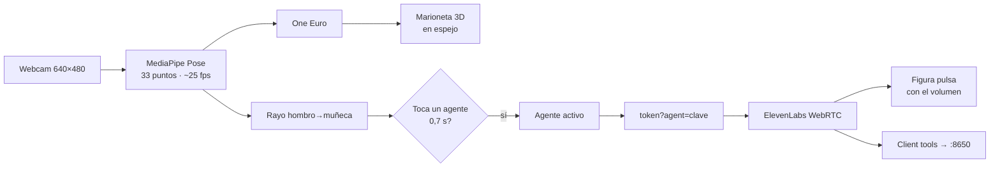

> Documento HISTÓRICO: es el plan con el que se construyó `/sala` en el proyecto
> del que salió este repo. Se conserva porque explica las decisiones y lo que
> quedó fuera de alcance; las rutas de archivos que menciona son las de allá.

# Sala de Agentes 3D

2026-09-17 · Rulo

Doc vivo (comentarios y edición): https://claude.ai/code/artifact/b523c3e0-44c4-4f54-9d95-cdae262866e9

## Qué se ve

Una sala 3D a pantalla completa con cinco agentes de pie, cada uno dueño de un proyecto real de Hermes, y un avatar que copia el cuerpo de Rulo desde la webcam. Señalar a un agente con el brazo abre una conversación de voz con él, con su voz y su cara. Nada en pantalla es decorado: proyectos, skills y estado salen del vault y de Supabase.

| Segundo | Qué pasa en pantalla | Qué lo hace |
| --- | --- | --- |
| 0–10 | Abre `/sala`: piso con grilla, luz baja, cinco figuras en arco, cada una con su color, su nombre y su retrato flotando | three.js + config de agentes |
| 10–25 | Rulo entra al cuadro; su avatar aparece al frente y copia brazos y torso en tiempo real, en espejo | MediaPipe Pose → marioneta |
| 25–40 | Levanta el brazo y señala a Nevada; un anillo se llena en 0,7 s y la figura se enciende | rayo hombro→muñeca + dwell |
| 40–70 | «¿Cómo va la propuesta de la Cámara de Comercio?» — Nevada responde con su voz, su figura pulsa al hablar y lee el estado real del proyecto | agente ElevenLabs de Nevada + `get_project_status` |
| 70–85 | Señala a Teacher; Nevada se calla, Teacher saluda en inglés con otra voz | cambio de agente en la misma llamada |
| 85–90 | Baja el brazo: la llamada cierra y la sala vuelve a reposo | fin |

El demo cabe en el track **Delight** del Build Day: algo que antes no se podía hacer así de bien ni así de rápido.

## Lo que ya existe y se reutiliza

Más de la mitad del demo ya está construido en `hermes-os`: el motor 3D, el tracking por cámara, la voz con cambio de agente y la generación de retratos. Hoy se ensambla, no se inventa.

| Pieza | Qué aporta al demo | Dónde está |
| --- | --- | --- |
| three.js 0.185 en la web | Escena, `InstancedMesh`, luces, raycasting; `readToken()` para colores del tema | `apps/web/src/components/CodeGraph3D.tsx` (tab Memoria) y `components/voice/VoiceOrb3D.tsx` |
| MediaPipe `tasks-vision` 0.10.35 | WASM local en `public/mediapipe/wasm` con fallback a CDN, delegate GPU, seam de simulación `window.__hermes*Sim` para QA sin cámara | `apps/web/src/hooks/useGraphHands.ts` (patrón a copiar para Pose) · `apps/web/scripts/setup-mediapipe.mjs` (baja los modelos en `predev`/`prebuild`) |
| Filtro One Euro + histeresis de pinza | Suavizado de landmarks sin lag; ya calibrado | `apps/web/src/lib/gestures/one-euro.ts` · `graph-engine.ts` |
| Voz ElevenLabs (`@elevenlabs/react` 1.15) | `ConversationProvider` global; `useVoiceConnect.switchToTutor()` ya corta una llamada y conecta OTRO agente en la misma sesión | `apps/web/src/app/providers.tsx` · `apps/web/src/hooks/useVoiceConnect.ts` |
| Token por agente | `GET /api/elevenlabs/token?agent=tutor` (web) y la ruta espejo en Hono; hoy solo conoce `tutor` y default | `apps/web/src/app/api/elevenlabs/token/route.ts` · `apps/agent/src/index.ts` (~l. 2353) |
| Dos agentes ElevenLabs ya creados | **Hermes** (voz Valeria, es) y **English Tutor** (voz Jessica, en, `eleven_flash_v2`): dos de los cinco personajes salen gratis | `apps/agent/scripts/setup-elevenlabs-agent.ts` (upsert por nombre: crea o parchea) |
| Client tools de voz | `run_task`, `get_project_status`, `focus_project`, `search_memory`… corren en el browser y llaman al agente local | `apps/web/src/components/VoiceClientTools.tsx` |
| Retrato desde una foto | Higgsfield (si hay keys) o `gpt-image-1`; guarda en `~/.hermes-os/avatars/` | `apps/agent/src/avatar.ts` · `POST /avatar/terminator` |
| Captura de cámara a JPEG | `getUserMedia` → canvas 1024 px → `toBlob` 0.92 | `apps/web/src/app/dev/terminator/page.tsx` |
| Página suelta sin shell | Fullscreen sin rail ni presence bar; el molde para `/sala` | `apps/web/src/app/dev/terminator/` y `dev/gestos/` |
| Proyectos reales | `GET /projects` devuelve 15 (12 activos) con `estado` del vault | `apps/agent/src/vault/projects.ts` |

Lo que **no** existe y hay que construir hoy: el modelo de cuerpo (Pose), la marioneta 3D, el rayo de señalar con dwell, tres agentes ElevenLabs nuevos y la generalización de `?agent=tutor` a `?agent=<clave>`.

## Arquitectura

Tres flujos independientes que se tocan en un solo punto: el rayo de señalar decide con qué agente habla la voz. Todo corre en el browser salvo las client tools, que llaman al agente local en `:8650` como hoy.



El cuerpo, el señalar y la voz son loops separados con su propio ritmo; ninguno bloquea a otro.

**Cuerpo.** `PoseLandmarker` (modelo `pose_landmarker_lite.task`, ~5,5 MB, se agrega a `setup-mediapipe.mjs` junto al de manos) con `numPoses: 1` y delegate GPU. Se usan los `worldLandmarks`: vienen en metros con origen en la cadera, así que la marioneta se arma directo en unidades de escena sin calibrar. Cada punto pasa por un One Euro (ya existe) y la figura son 33 esferas unidas por las `POSE_CONNECTIONS` como cilindros finos, con `x` invertida para que sea espejo. El avatar vive en un punto fijo al frente de la sala: Rulo no camina, mueve brazos y torso.

**Señalar.** Brazo en alto = muñeca (15/16) por encima del hombro (11/12) y codo extendido (ángulo > 150°). El rayo sale del hombro en dirección a la muñeca, ya en espacio de escena, y se lanza contra una `Sphere` de radio 0,6 alrededor de cada agente. Si el mismo agente recibe el rayo 0,7 s seguidos (dwell), se selecciona: un anillo se llena en su base y la figura sube su emisivo. Bajar el brazo 1,5 s o `Esc` suelta. No se usan las manos (`HandLandmarker`): un solo modelo de visión por frame deja el presupuesto a three.js.

**Voz.** Seleccionar un agente llama `switchTo(clave)`: la generalización de `switchToTutor()` que ya existe en `useVoiceConnect.ts` — `endSession()` si hay una llamada, `GET /api/elevenlabs/token?agent=<clave>`, `startSession({ conversationToken, connectionType: "webrtc" })`. La ruta del token pasa de un `if tutor` a un mapa `clave → agent_id` leído de la config. Mientras el agente habla, su figura pulsa con `getOutputVolume()` del SDK (fallback: `isSpeaking` para un pulso fijo). Cada agente ElevenLabs lleva su prompt, su voz y un `focus_project` fijado a su proyecto, así que `get_project_status` y `run_task` ya responden sobre lo suyo sin cambios en el agente local.

**Config, no código.** Los cinco personajes viven en `~/.hermes-os/sala.json` (`clave`, nombre, proyecto, color, `agent_id`, retrato) y el agente los sirve en `GET /sala/agents`; la escena los lee una vez al montar. Es la regla del repo: ningún nombre propio en el código.

| Loop | Ritmo | Dónde corre |
| --- | --- | --- |
| Render three.js | 60 fps, pausa con el tab oculto | `requestAnimationFrame` |
| Pose | ~25 fps, un `detectForVideo` por frame de video | worker del WASM, GPU |
| Rayo + dwell | Cada frame de pose | Puro, sin React (`lib/sala/point.ts`) |
| Voz | WebRTC, latencia ~300 ms | `ConversationProvider` global |

## Los agentes del mundo

Cinco personajes, cada uno dueño de un proyecto activo del vault. Dos ya existen como agentes de ElevenLabs (Hermes y el tutor) y se reutilizan tal cual; los otros tres se crean con el mismo script de setup, con voces que ya están en la biblioteca de la cuenta.

| Clave | Nombre | Proyecto | Qué sabe hacer (client tools) | Voz (ElevenLabs) | Silueta y color |
| --- | --- | --- | --- | --- | --- |
| `hermes` | Hermes | `hermes-os` (orquestador) | `run_task`, `search_memory`, `get_daily_brief`, `create_event` | Valeria · `NoS5MJPorMp1e5EcDXzn` · **ya existe** | Cabeza esfera, la más alta, blanco cálido |
| `nevada` | Nevada | `nevadatech` | `get_project_status`, `run_task`; sabe los 3 tiers (490 / 1.190 / 2.490 USD) y la pieza para la Cámara de Comercio | Eleguar Deep Latin American · `q2XMPZ6icuVDBj7rgCxQ` | Cabeza cubo, ancho, azul acero |
| `show` | Show | `rulocodeshow` | `create_content_idea`, `list_content_pieces`, «¿qué grabo el sábado?» | Ninoska · `zl1Ut8dvwcVSuQSB9XkG` | Cabeza icosaedro, delgada, terracota |
| `care` | Care | `careways` | `get_project_status`, juntas y accionables del cliente, `list_linear_issues` | Fernanda Sanmiguel · `1aJyZpkt0vxhGPBnPyrs` | Cabeza cono, media, verde salvia |
| `teacher` | Teacher | `ingles` | `save_vocab`, `recall_vocab`, `end_practice_session`; habla en inglés | Jessica · `cgSgspJ2msm6clMCkdW9` · **ya existe** | Cabeza toro, baja, ámbar |

**Prompt de cada agente nuevo.** Copia la plantilla de `tutorConfig()` en `setup-elevenlabs-agent.ts`: `language: "es"`, `llm: claude-haiku-4-5` (como Hermes), `eleven_flash_v2_5`, `first_message` de una frase en su tono, y un prompt de ~10 líneas que diga quién es, qué proyecto le toca y que use `get_project_status("<slug>")` antes de opinar. El `focus_project` va fijo en el prompt, no como tool.

**Apariencia.** La misma figura base (cápsula de cuerpo + cabeza) con tres variables: forma de la cabeza, altura y color. Con eso se distinguen a diez metros sin leer el nombre. Encima de la cabeza flota una tarjeta con el nombre y, si existe, el **retrato**: una imagen por agente generada una sola vez con `gpt-image-1` (texto a imagen, no edición) desde un prompt por personaje y guardada en `~/.hermes-os/avatars/sala/<clave>.png`. Sin retrato, la tarjeta muestra solo el nombre: el demo no depende de la generación.

**Estado real.** Al cargar, la sala pide `GET /projects` y pinta bajo cada agente el `estado` del vault de su proyecto (activo, por definir…) y el número de tareas abiertas en Linear si la key está. Es la regla del dashboard: todo dato visible es real.

## Plan de construcción de hoy

Seis fases en orden, unas 5 horas. Las fases 1 a 4 son el camino crítico y cada una deja algo que se ve en pantalla; 5 y 6 entran solo si sobra tiempo. Hecho = el guion de 90 segundos corre tres veces seguidas sin tocar el teclado.

| # | Fase | Qué se construye | Archivos | Listo cuando |
| --- | --- | --- | --- | --- |
| 0 | Preparación · 20 min | `sala.json` con los 5 agentes; `setup-elevenlabs-agent.ts` crea Nevada, Show y Care (misma función de upsert); `setup-mediapipe.mjs` baja `pose_landmarker_lite.task`; `GET /sala/agents`; la ruta del token pasa a mapa `clave → agent_id` | `~/.hermes-os/sala.json` · `apps/agent/scripts/setup-elevenlabs-agent.ts` · `apps/web/scripts/setup-mediapipe.mjs` · `apps/agent/src/index.ts` · `apps/web/src/app/api/elevenlabs/token/route.ts` | `pnpm setup:elevenlabs` imprime 5 `agent_id`; `curl :8650/sala/agents` devuelve 5; `curl /api/elevenlabs/token?agent=nevada` da token |
| 1 | Sala vacía · 45 min | Ruta `/sala` como página suelta sin shell; escena three.js: piso con grilla, niebla, cámara fija, 5 figuras en arco leídas de la config, tarjeta con nombre sobre cada una; colores por `readToken()`; loop pausado con el tab oculto | `apps/web/src/app/sala/page.tsx` · `apps/web/src/components/sala/SalaScene.tsx` · `lib/sala/figures.ts` | Se ven 5 figuras distintas con su nombre a 60 fps en ambos temas |
| 2 | Marioneta · 60 min | `usePose` copiado de `useGraphHands` (WASM local, GPU, `numPoses: 1`, seam `window.__hermesSalaSim`); `puppet.ts` puro: `worldLandmarks` → posiciones en escena, espejo, One Euro por punto; 33 esferas + cilindros por `POSE_CONNECTIONS` | `apps/web/src/hooks/usePose.ts` · `lib/sala/puppet.ts` · `lib/sala/puppet.test.ts` | Levantas el brazo derecho y la figura levanta el izquierdo (espejo); el seam mueve la marioneta sin cámara |
| 3 | Señalar · 45 min | `point.ts` puro: brazo en alto (muñeca sobre hombro + codo > 150°), rayo hombro→muñeca, máquina de estados del dwell (0,7 s) y del release (1,5 s); raycast contra `Sphere` por agente; anillo que se llena; emisivo al seleccionar | `lib/sala/point.ts` · `lib/sala/point.test.ts` (landmarks sintéticos, `pnpm test`) | Señalas a cada uno de los 5 y se selecciona en ~0,7 s; bajar el brazo suelta; el test cubre los dos umbrales |
| 4 | Voz · 60 min | `switchTo(clave)` en `useVoiceConnect` (generaliza `switchToTutor`); seleccionar → conecta; soltar o `Esc` → `endSession`; la figura pulsa con `getOutputVolume()`; `VoiceClientTools` no cambia | `apps/web/src/hooks/useVoiceConnect.ts` · `components/sala/SalaVoice.tsx` | Le preguntas a Nevada por NevadaTech y responde con datos del vault; señalas a Teacher a mitad y cambia de voz e idioma |
| 5 | Retratos y estado · 40 min | `pnpm sala:portraits` genera un PNG por agente con `gpt-image-1` desde el prompt de `sala.json` (salta los que ya existen); la tarjeta lo muestra; bajo cada figura el `estado` del vault | `apps/agent/scripts/sala-portraits.ts` · `GET /sala/portrait/:clave` | Hay 5 PNG en `~/.hermes-os/avatars/sala/`; sin PNG la tarjeta muestra solo el nombre |
| 6 | Pulido y ensayo · 40 min | Luz cálida + sombra suave, respiración en reposo, entrada en ⌘K «Sala de agentes», `HERMES_SALA=off` apaga la ruta | `lib/commands.ts` | El guion de 90 s corre 3 veces seguidas; `pnpm typecheck` y `pnpm test` en verde |

**Orden de los commits.** Uno por fase, mensaje `feat(sala): …`. La fase 0 toca el agente y hay que reiniciarlo (`launchctl kickstart -k gui/$UID/com.hermes-os.agent`, o el proceso de `pnpm dev` que esté corriendo en `:8650`); las fases 1 a 6 son solo web y se ven en caliente en `:31999`.

**Si algo se atasca.** La marioneta no aparece → primero el seam (`window.__hermesSalaSim(frame)`) para separar visión de render. El rayo no selecciona → dibujar el rayo como `Line` roja un frame y mirar dónde cae. La voz no conecta → `curl` al token con la clave; si es 503, es `sala.json`, no el browser.

## Decisiones cerradas y fuera de alcance

Estas decisiones ya están tomadas; el chat que construye no las reabre. Cada una cambia una alternativa más vistosa por una que cabe en el día.

| Decisión | En vez de | Por qué |
| --- | --- | --- |
| Marioneta de esferas y cilindros | Personaje GLB con rig y retargeting | El retargeting de 33 puntos a un esqueleto ajeno es el sumidero de tiempo clásico; la marioneta se lee como «ese soy yo» igual y se arma en una hora |
| Solo `PoseLandmarker` | Pose + `HandLandmarker` a la vez | Dos modelos por frame bajan el render a ~30 fps en la MacBook; para señalar basta el brazo, y el pose ya trae la muñeca |
| `worldLandmarks` en metros | Landmarks normalizados de pantalla | Dan la escena en 3D sin calibración y el rayo de señalar sale en el mismo espacio que las figuras |
| Dwell de 0,7 s para seleccionar | Gesto de pinza o voz | El dwell no exige precisión de mano y se entiende sin explicación desde el público |
| Un agente ElevenLabs por personaje | Un solo agente que cambia de persona por prompt | La voz distinta es lo que vende el demo, y `switchToTutor` ya probó que cambiar de agente en la misma sesión funciona |
| Avatar fijo al frente, sin caminar | Locomoción por la sala | Caminar exige cámara de cuerpo entero y espacio físico; el escenario del Build Day es una mesa |
| Config en `~/.hermes-os/sala.json` | Constantes en el código | Regla del repo: ningún nombre propio en código; el mismo `/sala` corre en la máquina de cualquiera |
| `gpt-image-1` texto-a-imagen para retratos | Higgsfield con SOUL | Un retrato por agente, una vez, síncrono; no vale el flujo de presigned upload + polling para 5 imágenes |
| Lógica de `point.ts` y `puppet.ts` pura con tests | Lógica dentro del componente | Se prueba con landmarks sintéticos en `pnpm test` sin cámara, igual que `engine.ts` de gestos |

**Fuera de alcance hoy** (se anota, no se hace): agentes que se mueven o se miran entre sí · varias personas frente a la cámara · versión móvil o VR · subtítulos de la conversación en la escena · memoria compartida entre personajes · física o colisiones · audio espacial · lipsync real.

**Riesgos conocidos.** El permiso de cámara en Chrome cae si la página no es `localhost` o `https` (en el Build Day, abrir en `localhost:31415`, no por IP). `getOutputVolume()` hay que confirmarlo en `@elevenlabs/react` 1.15 al arrancar la fase 4; si no está, `isSpeaking` da un pulso fijo y el demo no cambia. Los agentes con `language: "es"` aceptan `eleven_flash_v2_5`; Teacher sigue en `eleven_flash_v2` porque es `en`.

## Prompt de arranque para el otro chat

Pégalo tal cual en un Claude Code abierto en `~/dev/side/hermes-os`. Lleva el contexto mínimo y apunta a este doc para todo lo demás.

```text
Vamos a construir HOY la "Sala de Agentes 3D" en hermes-os: una página /sala a pantalla completa con cinco agentes en three.js, mi cuerpo capturado por webcam con MediaPipe Pose como marioneta en espejo, señalar con el brazo a un agente (dwell 0,7 s) para hablar con él por ElevenLabs con su propia voz.

El plan completo, las decisiones ya tomadas y lo que queda fuera están en docs/sala-de-agentes-3d.md (y en el doc vivo https://claude.ai/code/artifact/b523c3e0-44c4-4f54-9d95-cdae262866e9) y NO se reabren.

Reglas:
1. Lee primero CLAUDE.md del repo y la sección "Lo que ya existe y se reutiliza" del doc. Copia patrones existentes (useGraphHands para el hook de Pose, switchToTutor para el cambio de agente, /dev/terminator para la página suelta); no reescribas lo que ya funciona.
2. Sigue las fases 0→6 del doc en orden. Cada fase termina con su verificación cumplida y UN commit `feat(sala): …`. No arranques la siguiente sin que la anterior se vea en pantalla.
3. La lógica de puppet.ts y point.ts es pura y con tests en `pnpm test` (landmarks sintéticos), como lib/gestures/engine.ts. Cada una trae un seam `window.__hermesSalaSim` para QA sin cámara.
4. Nada de nombres propios en código: los cinco agentes salen de ~/.hermes-os/sala.json vía GET /sala/agents. Todo dato visible es real (proyectos y estado del vault).
5. pnpm typecheck y pnpm test en verde antes de cada commit. Dev web en :31999; el agente ya corre en :8650 (reinicio solo en la fase 0).
6. Si una fase se pasa 30 min de su estimado, para, me dices qué se atascó y proponemos el recorte; no sigas solo.

Empieza por la fase 0: muestra sala.json propuesto y los cambios al script de ElevenLabs antes de crear los agentes (crear agentes gasta cuota).
```
